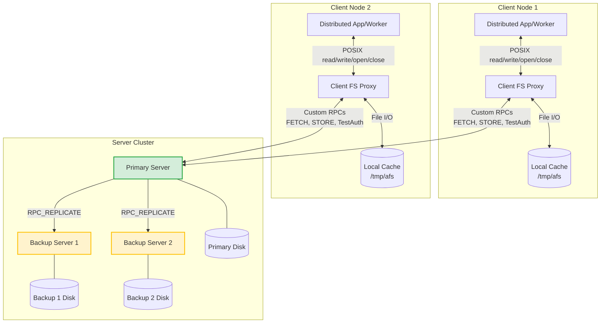
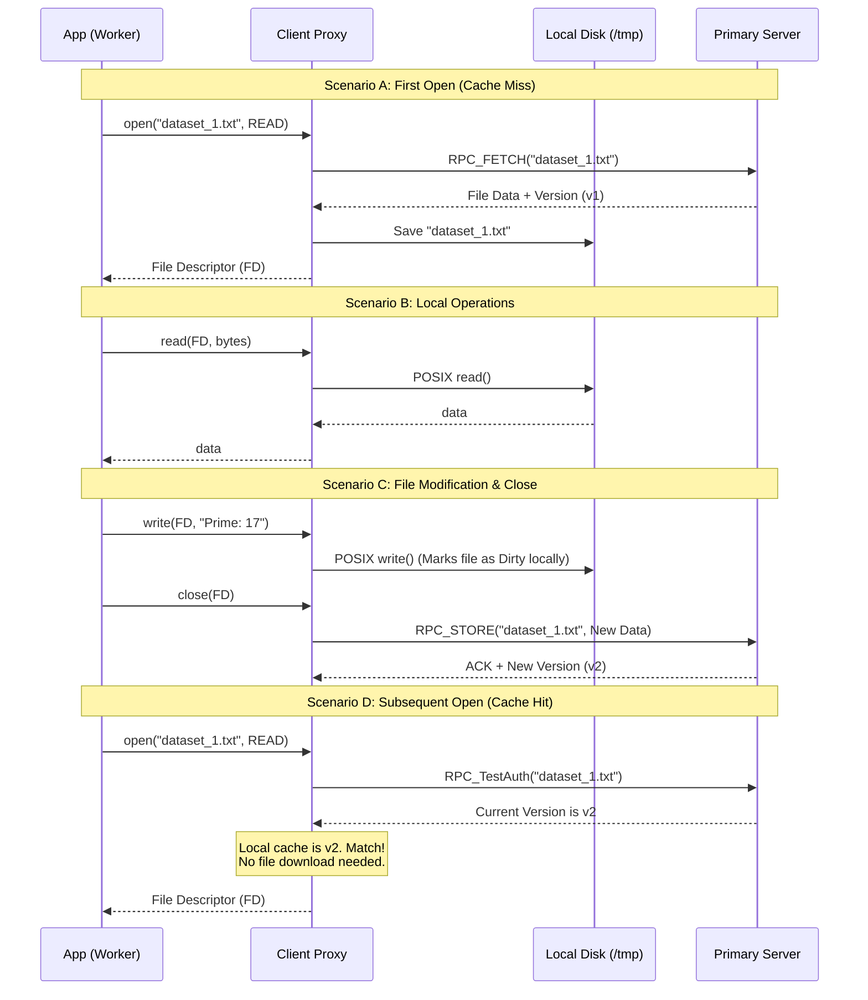
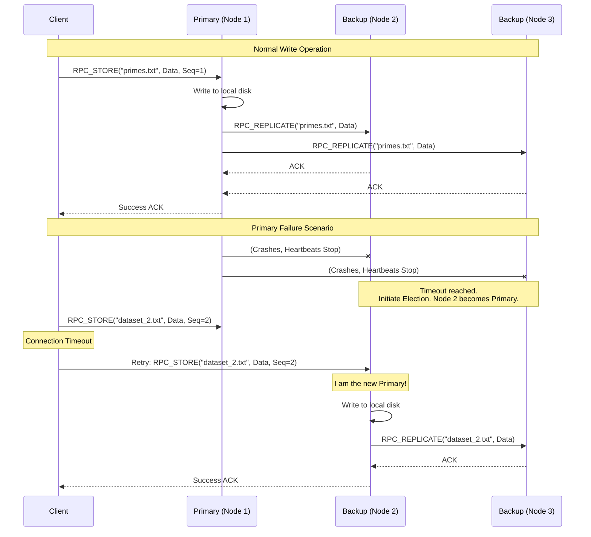

### System Architecture Overview

* **Client Node:** Acts as a proxy. It intercepts application file requests, manages the local cache (e.g., `/tmp/afs`), and communicates with the server via custom RPCs.
* **Server Nodes (Primary + Backups):** Store the authoritative state of the files. The Primary handles all client requests and synchronizes writes to the Backups.
* **RPC Framework:** A custom, lightweight TCP-based protocol to marshal/unmarshal requests and responses.
* **Consistency Model:** Close-to-open consistency. Changes made by a client are only visible to others once the client closes the file.

---

### Detailed Design & Task Breakdown

#### Task 1A: Basic Client-Server with Custom RPC

**Goal:** Establish communication and enable basic remote file operations without caching.

1. **Build the Custom RPC Framework:**
* **Transport:** Use TCP sockets for reliable data transfer (crucial for whole-file transfers).
* **Message Framing:** Design a simple protocol header. For example: `[Message Length (4 bytes)][Opcode (1 byte)][Payload]`.
* **Serialization:** Since you can't use complex libraries, use basic JSON, Pickle (if Python), or manual byte-packing for metadata, followed by raw binary data for file contents.

2. **Implement Server Stubs:**
* Create a multi-threaded socket server. For each incoming connection, spawn a thread to handle the request.
* Map incoming Opcodes to server-side functions:
* `RPC_OPEN`: Return file metadata (version number, size).
* `RPC_FETCH`: Send the entire file content over the socket.
* `RPC_STORE`: Receive file content and overwrite the server's copy. Increment the file's version number.

3. **Implement Client API:**
* Create a client class with `open()`, `read()`, `write()`, and `close()` methods.
* *For this step only*, you might have `read()` and `write()` trigger network calls, OR immediately jump to whole-file fetching to set up for Task 1B. (I recommend the latter: `open()` triggers `RPC_FETCH`, `close()` triggers `RPC_STORE`).

#### Task 1B: Client-side File Caching (AFSv1 Style)

**Goal:** Move reads and writes to the local disk and minimize network traffic.

1. **Local Directory Management:**
* Ensure the client initializes with a local cache directory (e.g., `/tmp/afs`).
* Maintain a local metadata table (e.g., a dictionary mapping `filename -> (local_path, version_number, is_dirty)`).

2. **The `open(filename, mode)` Logic:**
* If the file is **not** in the local cache: Send `RPC_FETCH` to the server, save the file to `/tmp/afs`, and record its version number. Open the local file using POSIX `open()`.
* If the file **is** in the local cache: Send a `TestAuth` RPC (essentially a `Stat` request) to the server to get the latest version number.
* If `server_version == local_version`: Do nothing. Open the local file.
* If `server_version > local_version`: Invalidate local cache, trigger `RPC_FETCH`, overwrite local file, update version, then open.

3. **The `read()` and `write()` Logic:**
* These are strictly local POSIX operations (`pread`/`pwrite` or standard file I/O) on the cached copy in `/tmp/afs`.
* If a `write()` occurs, mark the file as `is_dirty = True` in the local metadata.

4. **The `close(filename)` Logic:**
* Close the local POSIX file descriptor.
* If `is_dirty == True`: Send an `RPC_STORE` to the server with the entire modified file. Wait for an acknowledgment. Reset `is_dirty` to `False`.

#### Task 2: Support Fault Tolerance

**Goal:** Handle network drops, server crashes, and client crashes gracefully.

1. **RPC Timeouts & Retries:**
* Implement timeouts on all client socket operations. If the server doesn't respond within $X$ seconds, retry the RPC.

2. **Idempotency & Sequence Numbers:**
* Because you will retry requests, the server needs to know if an `RPC_STORE` is a retry of a request it already processed (to avoid versioning issues).
* Attach a unique `Client_ID` and a monotonically increasing `Sequence_Number` to every RPC. The server caches the last applied sequence number for each client.

3. **Graceful Recovery on Client Side:**
* If the server crashes during an `RPC_STORE` (close), the client should queue the update locally and keep retrying periodically, or immediately query for a new Primary server (hooks into Task 3).

#### Task 3: Replicate the File Server

**Goal:** Ensure High Availability (HA) using a Primary-Backup replication strategy (simplest approach without libraries).

1. **Node Initialization & Discovery:**
* Start 3 server nodes. Pass a configuration file to each detailing the IP/Ports of all 3 nodes.
* Assign ranks (e.g., Node 1, Node 2, Node 3). Node 1 boots as the Primary, others as Backups. Clients are configured with the IPs of all three servers.

2. **Handling Writes (Replication):**
* When the Primary receives an `RPC_STORE` from a client, it does **not** immediately reply "Success".
* The Primary forwards the file and new version number to all active Backups via an internal `RPC_REPLICATE` call.
* Once the Primary receives ACKs from the Backups (or a quorum), it commits the write to its own disk and replies "Success" to the client.

3. **Failure Detection (Heartbeats):**
* The Primary sends periodic UDP or TCP heartbeats to the Backups.
* Backups monitor these heartbeats. If the Primary goes silent for a timeout period (e.g., 3 seconds), a failure is detected.

4. **Leader Election:**
* Use a simple Bully Algorithm or Rank-based election. If Node 1 dies, Node 2 and 3 communicate. Node 2 has the highest remaining rank, so it promotes itself to Primary.
* When the client retries its failed `RPC_STORE`, Node 1 won't answer. The client tries Node 2. Node 2 accepts the request.

5. **State Sync (Recovery):**
* If Node 1 wakes back up, it realizes it is no longer the Primary.
* It sends an `RPC_SYNC` to the new Primary (Node 2).
* Node 2 sends over the latest version of the mutable directories/files (specifically, `primes.txt` and its version number). Node 1 updates its persistent state and resumes duty as a Backup.

---

### Some Important Notes for this Specific Workload

* **No Concurrent Writes:** Since input files are read-only and `primes.txt` is write-once (or updated sequentially by workers), you don't need complex distributed locking or file leasing.
* **Large Files:** Because the files contain "millions of numbers", a single `RPC_FETCH` could be tens of megabytes. Ensure your TCP socket `recv()` loops correctly buffer data until the expected message length is fully received. Don't assume a single `recv()` call fetches the whole file.

### 1. High-Level System Architecture

Your system consists of Client nodes and a cluster of Server nodes. The servers hold the authoritative, persistent data. The clients pull data into a local user-space cache (`/tmp/afs`), operate on it locally, and push it back upon closing.

---

### 2. Task 1 Breakdown: RPC and Client-Side Caching

In an AFS-like system, the network is only used during `open()` and `close()`. All reads and writes happen on the local disk. This is what provides the massive performance boost for read-heavy workloads like primality testing.

**Detailed Workflow:**

* **Cache Miss:** The client opens a file it hasn't seen before. It asks the server for the file, downloads the whole thing, and saves it to `/tmp/afs`.
* **Cache Hit (Valid):** The client opens a file already in `/tmp/afs`. It sends a lightweight `TestAuth` (or `GetAttributes`) RPC to the server. If the server's version matches the client's cached version, no data is downloaded.
* **Cache Hit (Stale):** The `TestAuth` reveals the server has a newer version (e.g., another worker updated the primes list). The client invalidates its cache and fetches the new file.

---

### 3. Tasks 2 & 3 Breakdown: Fault Tolerance and Replication

To make the system highly available, a single server isn't enough. You will use a **Primary-Backup** model.

**Detailed Workflow for Replication (Synchronous):**
When a client closes a modified file, it sends `RPC_STORE` to the Primary. To guarantee the file isn't lost if the Primary crashes immediately after, the Primary *must* replicate the file to the Backups before telling the client "Success".

**Detailed Workflow for Fault Tolerance:**

1. **Heartbeats:** The Primary constantly pings the backups. Backups expect these pings.
2. **Failure Detection:** If a backup stops hearing from the Primary, it assumes the Primary is dead.
3. **Election:** The backups negotiate (e.g., the one with the lowest IP or highest pre-assigned rank wins) and one promotes itself to Primary.
4. **Client Retry:** The client, whose connection to the dead Primary just timed out, loops through its list of known server IPs and retries its `RPC_STORE` request until the new Primary responds.

### Key Considerations for Our Implementation

* **Idempotency is Critical:** In the failure scenario above, what if the Primary crashed *after* replicating to the backups, but *before* replying to the client? The client will retry the request to the new Primary. The new Primary needs a way to recognize "I already have Sequence Number 2 from this client" so it doesn't process the same file operation twice.
* **Buffer Sizes:** For `RPC_FETCH` and `RPC_STORE`, do not try to load a multi-gigabyte file into RAM all at once. Read the file in chunks (e.g., 4MB blocks) on the sender side, push them over the TCP socket, and write them sequentially to disk on the receiver side.
